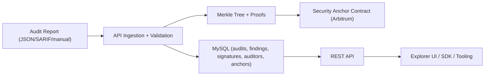

# VeriSec

VeriSec is a security data oracle for Arbitrum.  
It converts audit reports into structured, signed, Merkle-verifiable security data that can be consumed by APIs, SDKs, and smart contracts.

## What Is Implemented

- Audit ingestion + schema validation (`audit.schema.json`)
- Canonical finding normalization + MySQL storage
- Merkle proof generation per finding
- Auditor registry + signed submission verification (`eip191`)
- On-chain anchor flow (Arbitrum, configurable via env)
- Explorer UI with:
  - audit index
  - detailed audit page (`/audits/[auditId]`)
  - findings + proof links
  - auditor registry
  - signed submission upload + wallet-assisted signing
- API integration tests for core security paths

## Architecture



## Monorepo Layout

- `apps/api` - Fastify API, migrations, seed loader, proofs, anchoring integration
- `apps/web` - Next.js Explorer UI
- `packages/schema` - shared schema/types/canonicalization helpers
- `contracts` - Hardhat project (`SecurityAnchor`)
- `docs/branding` - logo assets

## Local Development

### Prerequisites

- Node.js 20+
- npm 10+
- Docker Desktop

### 1) Install dependencies

```bash
npm install
```

### 2) Start MySQL (Docker)

If container already exists:

```bash
docker start verisec-mysql
```

First-time setup:

```bash
docker run --name verisec-mysql \
  -e MYSQL_ROOT_PASSWORD=verisec \
  -e MYSQL_DATABASE=verisec \
  -p 3307:3306 \
  -d mysql:8
```

### 3) Configure environment files

`apps/api/.env.local`

```env
PORT=4010
DB_HOST=127.0.0.1
DB_PORT=3307
DB_USER=root
DB_PASSWORD=verisec
DB_NAME=verisec
DB_AUTO_MIGRATE=true
CORS_ORIGIN=http://localhost:3005

# Optional on-chain anchor config
ANCHOR_RPC_URL=
ANCHOR_PRIVATE_KEY=
ANCHOR_CONTRACT_ADDRESS=
ANCHOR_CHAIN_ID=
```

`apps/web/.env.local`

```env
PORT=3005
NEXT_PUBLIC_VERISEC_API_BASE_URL=http://localhost:4010
```

### 4) Start services

API:

```bash
cd apps/api
npm run dev
```

Web:

```bash
cd apps/web
npm run dev
```

Open:

- `http://localhost:3005`
- `http://localhost:4010/health`

### 5) Seed sample audits

```bash
cd apps/api
npm run seed:refresh
```

## API Surface (Core)

- `POST /v1/auditors`
- `GET /v1/auditors`
- `GET /v1/auditors/:address`
- `POST /v1/audits`
- `GET /v1/audits`
- `GET /v1/audits/:auditId`
- `GET /v1/audits/:auditId/findings`
- `GET /v1/audits/:auditId/findings/:findingId/proof`
- `POST /v1/submissions`
- `POST /v1/audits/:auditId/anchor`
- `GET /v1/audits/:auditId/anchors`

## Testing

API integration tests:

```bash
cd apps/api
npm test
```

Web build check:

```bash
cd apps/web
npm run build
```

## Deployment

### Frontend (Vercel)

Project root: `apps/web`

Required env var in Vercel:

- `NEXT_PUBLIC_VERISEC_API_BASE_URL=https://<public-api-url>`

### API (Railway)

`railway.json` is included for deployment from repo root.

Build/start scripts:

- `npm run build:api`
- `npm run start:api`

Set env vars on Railway service:

- `PORT` (Railway usually injects this)
- `DB_AUTO_MIGRATE=true`
- `CORS_ORIGIN=https://<your-vercel-domain>`
- DB connection values
  - either `DB_HOST/DB_PORT/DB_USER/DB_PASSWORD/DB_NAME`
  - or Railway-managed `MYSQLHOST/MYSQLPORT/MYSQLUSER/MYSQLPASSWORD/MYSQLDATABASE`
- optional anchor vars (`ANCHOR_*`) if on-chain anchoring should be active

After API is live, update Vercel `NEXT_PUBLIC_VERISEC_API_BASE_URL` and redeploy web.

## Security Notes

- Never commit private keys, API keys, or tokens.
- Use dedicated deployer wallets with minimal funds.
- Keep `ANCHOR_PRIVATE_KEY` only in secure runtime env (not in repo).

## Troubleshooting

- `No audits found`  
  Run `npm run seed:refresh` in `apps/api` and refresh the UI.

- `ECONNREFUSED` (DB)  
  Check MySQL container is running and env ports match.

- `EADDRINUSE`  
  A port is already taken. Stop the existing process or switch port.

- `No wallet provider detected`  
  Install/unlock MetaMask/Rabby/Coinbase Wallet and hard refresh.
